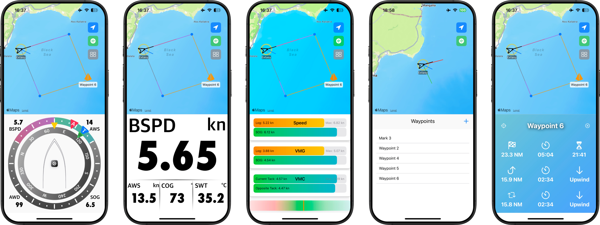
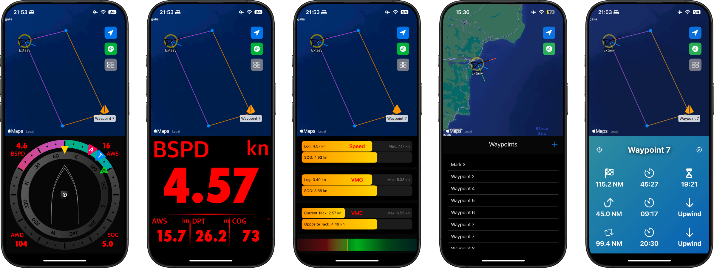

# Extasy Complete Navigation

[📱 Check out the iPhone demo video](https://youtube.com/shorts/T2OzuNGgfEw)

## Project description

This app was designed for a particular sailing boat but can be further developed to fit the needs of any other boat or vessel that works with the NMEA standard. It uses a Raspberry Pi connected to the B&G serial bus, receiving NMEA signals from various sensors (speed, wind, magnetic compass, depth, GPS). NMEA strings are sent over Wi-Fi via socket communication on port 4950, and the data is displayed in a user-friendly way on iOS devices (iPhone, iPad). 

### Note: The app requires an iOS device with iOS 17 or later.

Key Features:

## **Key Features of Extasy Complete Navigation**

- **📡 Real-time Data Display**  
  - Receives live sensor data via Wi-Fi from the boat's NMEA system.  
  - Displays key navigation metrics such as speed, heading, depth, and wind.

- **⛵ Polar Diagram Integration**  
  - Optimizes sailing performance using the boat's predefined polar speeds.  
  - Helps achieve the best sailing efficiency based on wind and speed conditions.

- **📊 Multi Display View**  
  - Fully customizable display to track important sailing metrics.  
  - Persistent session settings allow users to save their preferred layout.  
  - Tap-to-swap feature enables quick reconfiguration of displayed values.

- **🗺️ Waypoint Management**  
  - Add, edit, and navigate to waypoints with an intuitive interface.  
  - Display waypoint position on the map with directional indicators.

- **🚨 Alarms & Alerts**  
  - Depth alarm triggers when water depth falls below a critical threshold.  
  - Future updates will allow customization of alarms for other parameters.

- **⚙️ Customizable Settings**  
  - Configure units (e.g., knots, meters, nautical miles) for different parameters.  
  - Option to view raw NMEA sensor data for troubleshooting and insights.  
  - Planned improvements include adjustable alarm thresholds and user preferences.

- **🔀 Multiple Display Modes**  
  - Switch between different views, including multi-display and ultimate display.  
  - A hidden display view reveals additional navigation information.

- **📍 Boat and Waypoint Tracking**  
  - Displays real-time boat position and heading relative to waypoints.  
  - Provides an estimated time of arrival (ETA) and velocity made good (VMG).  
  - Shows waypoint bearing (BTM) with an intuitive indicator.

- **💾 Persistent Data Storage**  
  - Saves user preferences and configurations across sessions.  
  - Ensures consistent UI layout even after restarting the app.

- **🌊 NMEA 0183 Protocol Compatibility**  
  - Works seamlessly with industry-standard NMEA 0183 data streams.  
  - Compatible with a variety of sensors, including GPS, wind, and depth instruments.

The app is developed in accordance with the [NMEA 0183 protocol v. 3.01.](https://www.plaisance-pratique.com/IMG/pdf/NMEA0183-2.pdf)

### Note: *This is the initial release and is still undergoing real-world tests and improvements. There is potential for additional features and optimization.*

## Installation

The app is still in development and not available on the App Store. You need an Apple developer account to install and test the app:
1. Clone the repository in Xcode.
2. Build and run the app on a simulator or a real device.

You will be able to use it for 7 days with free account and 1 year, or no-longer than you subscription expiration date, if you have paid developer subscription.

## Usage

Ensure you are on the same network as the device sending data on port 4950. The app will connect automatically and display sensor data on the relevant segments of the displays.

### Glossary

- DPT - Depth
- HDG - Heading (Magnetic Heading)
- SWT - Sea Water Temperature
- BSPD - Boat Speed through water (comes from the speed log)
- AWA - Apparent Wind Angle
- AWD - Apparent Wind Direction
- AWF - Apparent Wind Speed (or Apparent Wind Force)
- TWA - True Wind Angle
- TWD - True Wind Direction
- TWS - True Wind Speed (or True Wind Force)
- COG - Course Over Ground (comes from the GPS)
- SOG - Speed Over Ground (comes from the GPS)
- VMC - Velocity Made Good on course
- VMG - Velocity Made Good
- BTM - Bearing to Mark (or Bearing to Waypoint)
- DTM - Distance to Mark (or Distance to Waypoint)
- ETA - Estimated Time of Arrival

### Note: These values are used on S/Y Extasy but can be modified in the code as needed.

## **iPhone Screenshots - Light & Dark Mode**  

### **Highlighted Features**

- **📡 Real-Time Data Visualization**  
  - Display crucial sailing metrics such as Boat Speed (BSPD), Apparent Wind Speed (AWS), Course Over Ground (COG), and Sea Water Temperature (SWT).

- **📊 Multi Display View**  
  - A customizable dashboard for tracking essential performance parameters with an easy-to-use tap-to-swap layout.

- **📍 Waypoint Management**  
  - Add, view, and navigate waypoints with detailed information, including distance to mark (DTM), estimated time of arrival (ETA), and upwind/downwind indicators.

- **⚡ Advanced Performance Tracking**  
  - Monitor your sailing efficiency with real-time performance comparisons.  
  - Color-coded progress bars provide instant visual feedback on sailing conditions and performance.

- **🌙 Day & Night Modes**  
  - Ensures readability and usability in varying lighting conditions, with light mode for daytime clarity and dark mode for nighttime sailing.
 
## **Documentation**

This is a navigation application project, featuring modular MVVM architecture. For a detailed look at the project's structure, refer to the [Software Architecture Diagram](https://github.com/bacataBorisov/ExtasyCompleteNavigation/blob/main/ExtasyCompleteNavigation/Docs/ExtasyNavigation-SoftwareArchitectureMap.pdf).

## **Authors and Acknowledgment**

ExtasyCompleteNavigation was created by **[Vasil Borisov](https://github.com/bacataBorisov)**.

- [CocoaAsyncSocket](https://cocoapods.org/pods/CocoaAsyncSocket)
- Various articles from StackOverflow, Github and others

## **Changelog**

### **2.0.0 - [25-Jan-2025]**
#### **New Features**
- **Enhanced Multi-Display View:**  
  - Improved layout customization with persistent session settings.
  - Added tap-to-swap functionality for dynamic value reordering.

- **Optimized Performance Section:**  
  - Refined performance metrics visualization with gradient indicators.
  - Added support for tracking optimal and opposite tack speeds.

- **Waypoint Management Overhaul:**  
  - Enhanced waypoint tracking with better ETA and distance calculations.
  - Introduced a waypoint list for easier navigation and organization.

- **New iPhone and iPad Layouts:**  
  - Optimized UI for different screen sizes.
  - Improved readability and responsiveness across devices.

#### **Refactored**
- Introduced a more structured software architecture to align with best practices.
- Enhanced organization of files into logical layers (Data, Business, and Presentation).
- Implemented `SettingsManager` to manage user preferences efficiently.

#### **Bug Fixes**
- Fixed incorrect wind direction calculations under certain conditions.
- Resolved issues related to GPS data loss during background operation.
- Improved stability when switching between different display views.

#### **Performance Improvements**
- Optimized data processing to reduce CPU and memory usage.
- Improved app responsiveness during high data input rates.
- Enhanced data caching for better offline performance.

---

### **1.1.0 - [30-Nov-2024]**
#### **Refactored**
- Codebase refactored to improve modularity and maintainability.
- Introduced a more structured software architecture to align with best practices.
- Enhanced organization of files into logical layers (Data, Business, and Presentation).

No breaking changes. This update improves code quality for future development.

---

### **1.0.0 - Initial release**

## **Contact**

If you have any questions or comments about the project, please contact **[bacata.borisov](https://github.com/bacataBorisov)**.
Open to suggestions for improvement, new features, or collaborations.

